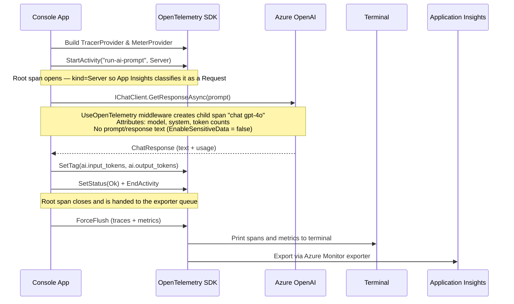

# helloworld.logging — How It Works

## Overview

This sample makes a single chat request to Azure OpenAI and records the full observability signal — a trace span, child dependency span, and token usage metrics — without capturing the actual prompt or response text. It is the baseline for all other samples in this workspace.

## Key components

| Component | Role |
|---|---|
| `AzureOpenAIClient` | Connects directly to Azure OpenAI using an API key |
| `IChatClient` | Provider-neutral abstraction from `Microsoft.Extensions.AI` |
| `UseOpenTelemetry()` | Middleware that auto-instruments each `GetResponseAsync` call |
| `TracerProvider` | OpenTelemetry pipeline routing spans to Console + App Insights |
| `MeterProvider` | OpenTelemetry pipeline routing metrics to Console + App Insights |

## Flow

## What you see in App Insights

- **Transaction search → Requests**: one entry named `run-ai-prompt`
- **Dependencies** (nested under that request): `chat gpt-4o` with duration and token count attributes
- **Metrics → customMetrics**: `gen_ai.client.token.usage` (input/output split) and `gen_ai.client.operation.duration`
