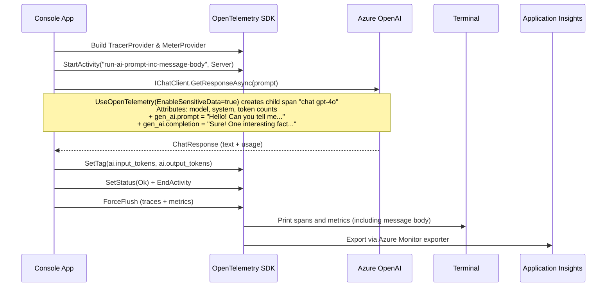

# helloworld.logging.with.message.body — How It Works

## Overview

Identical to `helloworld.logging` except for one line: `.UseOpenTelemetry(configure: o => o.EnableSensitiveData = true)`. This single flag causes the actual prompt text and response text to be recorded as span attributes on every AI call, making them visible in Application Insights traces.

## Key difference from helloworld.logging

```csharp
// helloworld.logging
.UseOpenTelemetry()

// helloworld.logging.with.message.body
.UseOpenTelemetry(configure: o => o.EnableSensitiveData = true)
```

With `EnableSensitiveData = true`, the `chat gpt-4o` dependency span gains two extra attributes:

| Attribute | Value |
|---|---|
| `gen_ai.prompt` | The full user message sent to the model |
| `gen_ai.completion` | The full response text returned by the model |

> **Production warning:** these attributes contain potentially sensitive content. Use only in environments where prompt and response data may be stored in your telemetry backend.

## Flow



## What you see in App Insights

- **Transaction search → Requests**: one entry named `run-ai-prompt-inc-message-body`
- **Dependencies** (nested): `chat gpt-4o` — open Custom Properties to see `gen_ai.prompt` and `gen_ai.completion` containing the full message text
- **Metrics**: same token usage and latency metrics as `helloworld.logging`
