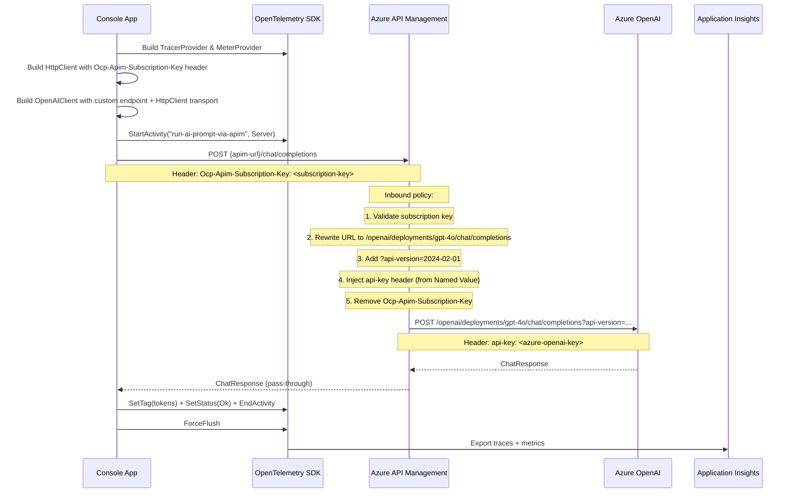

# helloworld.via.api.management — How It Works

## Overview

This sample routes all AI calls through **Azure API Management (APIM)** instead of calling Azure OpenAI directly. APIM acts as a gateway that validates the caller, rewrites the URL into the format Azure OpenAI expects, injects the Azure OpenAI key, and forwards the request.

The key code change vs the direct samples is replacing `AzureOpenAIClient` with `OpenAIClient`, injecting the APIM subscription key via a custom `HttpClient` header, and pointing the endpoint at the APIM gateway URL.

## Why OpenAIClient instead of AzureOpenAIClient?

`AzureOpenAIClient` hardcodes `/openai/deployments/{name}/chat/completions` into every request URL. If APIM exposes the API at `/chat/completions` (the common pattern), those paths won't match and APIM returns a 404 "Unable to match incoming request to an operation".

`OpenAIClient` with a custom endpoint calls `{endpoint}/chat/completions` directly — which matches the APIM operation path.

## Flow

## What you see in App Insights

- **Transaction search → Requests**: `run-ai-prompt-via-apim`
- **Dependencies**: `chat gpt-4o` — latency here includes APIM processing time on top of Azure OpenAI latency
- **Metrics**: same `gen_ai.client.token.usage` and `gen_ai.client.operation.duration` as in the direct samples

## APIM configuration required

See `ReadMe.APIM.md` in the workspace root for the full APIM inbound policy. Key steps the policy must perform:

1. Set backend service to `https://<your-resource>.openai.azure.com`
2. Rewrite URI: prepend `/openai/deployments/{deployment-name}` to the incoming path
3. Add `api-version` query parameter
4. Inject `api-key` header from a Named Value (keeps the Azure OAI key out of client code)
5. Remove `Ocp-Apim-Subscription-Key` before forwarding to the backend
