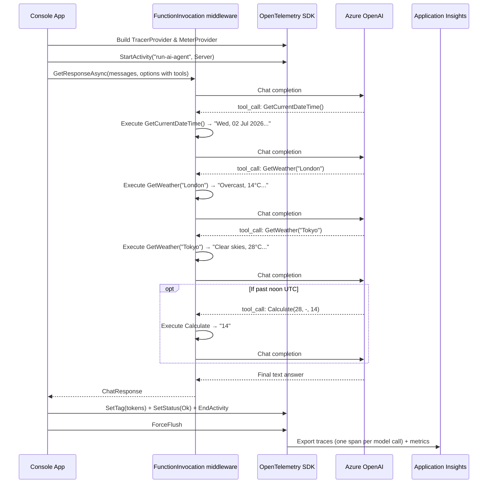

# helloworld.agent — How It Works

## Overview

This sample implements an **AI agent**: the model is given a set of tools and autonomously decides which to call, in what order, and how to combine their results into a final answer. The `UseFunctionInvocation()` middleware handles the entire tool-call loop — there is no manual loop code in `Program.cs`.

The user asks a question that requires multi-step tool use (check the time, check weather in two cities, optionally calculate a temperature difference). The model calls tools iteratively until it has everything it needs, then returns a synthesised answer.

## How this differs from helloworld.logging

`helloworld.logging` makes a single, static chat call and records the result. This sample turns that into an **agent**: the model is given tools, makes its own decisions about what to call, and runs multiple model calls until it has a complete answer.

| Aspect | helloworld.logging | helloworld.agent |
|---|---|---|
| **Tools** | None | GetCurrentDateTime, GetWeather, Calculate |
| **Middleware** | `.UseOpenTelemetry()` | `.UseFunctionInvocation()` + `.UseOpenTelemetry()` |
| **Message history** | Single string prompt | `List<ChatMessage>` with System + User roles |
| **Model calls per run** | Exactly 1 | 3–5 (one per tool call, plus final answer) |
| **`chat gpt-4o` spans** | 1 | 1 per model call — each tool-call leg is a separate span |
| **`EnableSensitiveData`** | `false` — no prompt/response text in traces | `true` — tool calls and results visible in every span |
| **Token cost** | Low (one call) | Higher (accumulates across all loop iterations) |
| **Prompt complexity** | "Tell me one interesting fact about AI" | Multi-step question requiring real-time data and calculation |

**When to build an agent instead of a simple chat call:**
- The answer cannot be determined from the model's training data alone (e.g. current time, live data)
- The task requires multiple distinct sub-steps whose results feed into each other
- The sequence of steps is not fixed — the model needs to decide what to do next based on intermediate results

## How the agentic loop works

```
1. App sends user message + tool definitions to the model
2. Model responds with a tool_call (e.g. GetCurrentDateTime)
3. UseFunctionInvocation middleware executes the tool locally
4. Tool result is appended to the message history
5. Updated history is sent back to the model
6. Steps 2–5 repeat until the model returns a plain text answer
```

`UseFunctionInvocation()` handles steps 2–5 automatically. `UseOpenTelemetry()` (registered after it, so it wraps the loop) records each individual model call as a separate child span with full message body.

## Flow



## What you see in App Insights

- **Transaction search → Requests**: `run-ai-agent` — expand it to see 3–5 `chat gpt-4o` dependency spans, one per model round-trip
- **Custom Properties** on each dependency span: `gen_ai.prompt` and `gen_ai.completion` showing the exact tool call and result JSON (because `EnableSensitiveData = true`)
- **Metrics**: token counts accumulate across all legs of the loop; each leg contributes its own `gen_ai.client.token.usage` data point
