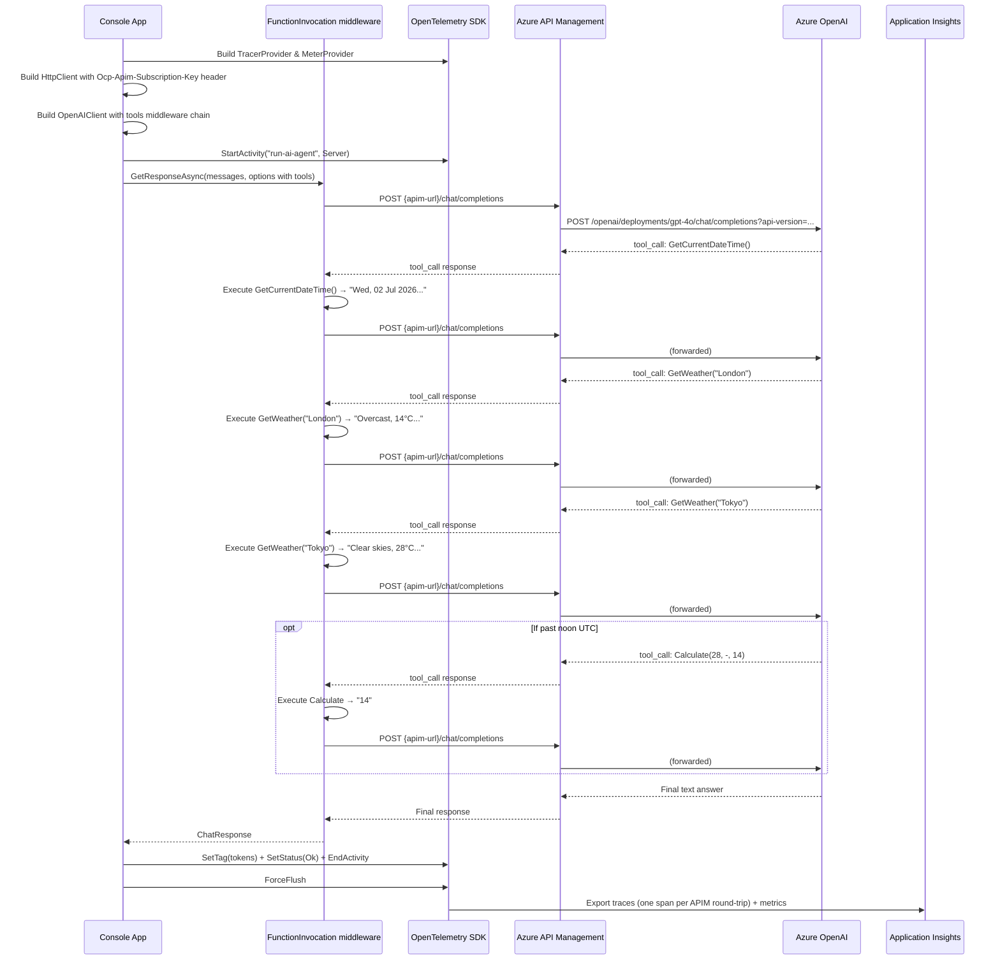

# helloworld.agent.via.api.management — How It Works

## Overview

This sample combines everything: an **AI agent** with tool use, routing through **Azure API Management**, and full **OpenTelemetry** observability with message body logging. It is the most complete sample in the workspace.

Every model call in the agentic loop goes through APIM — APIM validates the subscription key, rewrites the URL, injects the Azure OpenAI key, and forwards to the backend. Each leg of the loop produces its own OpenTelemetry span with full message body and tool call/result JSON.

## How this differs from helloworld.agent

`helloworld.agent` calls Azure OpenAI directly. This sample inserts APIM as a gateway between the application and Azure OpenAI. Everything else — the tools, the agentic loop, the telemetry — is identical.

| Aspect | helloworld.agent | helloworld.agent.via.api.management |
|---|---|---|
| **Client type** | `AzureOpenAIClient` | `OpenAIClient` with custom `HttpClient` transport |
| **Auth to AI service** | `AzureKeyCredential(apiKey)` passed to the client | `Ocp-Apim-Subscription-Key` header on `HttpClient` |
| **Endpoint in appsettings** | Azure OpenAI resource URL | APIM gateway URL |
| **Who holds the Azure OAI key** | The application (`appsettings.json`) | APIM (as a Named Value — never sent to the client) |
| **URL construction** | SDK appends `/openai/deployments/{name}/chat/completions` | SDK calls `{endpoint}/chat/completions`; APIM rewrites |
| **Network path** | App → Azure OpenAI | App → APIM → Azure OpenAI |
| **Tools** | GetCurrentDateTime, GetWeather, Calculate | Identical |
| **Agentic loop** | `UseFunctionInvocation()` | Identical |
| **Telemetry** | OTel → App Insights, `EnableSensitiveData = true` | Identical (latency includes APIM overhead per leg) |

**When to use APIM in front of an agent:**
- You want to centralise the Azure OpenAI key so it is never distributed to client machines
- You need rate limiting, quota management, or token budgeting across multiple callers
- You want APIM's built-in logging/tracing to complement your App Insights telemetry
- You are running multiple AI-powered services and want a single gateway policy point

## How the pieces fit together

```
OpenAIClient (custom HttpClient transport)
    ↓  adds Ocp-Apim-Subscription-Key header to every request
APIM gateway
    ↓  validates key, rewrites URL, injects api-key, adds api-version
Azure OpenAI
    ↑  response passes back through APIM unchanged
UseFunctionInvocation middleware
    ↑  executes tool locally, appends result, sends next request
UseOpenTelemetry middleware  (outermost — wraps the entire loop)
    ↑  records each model call as a separate child span
```

## Flow



## What you see in App Insights

- **Transaction search → Requests**: `run-ai-agent` — expand to see 3–5 `chat gpt-4o` dependency spans, one per APIM round-trip
- **Custom Properties** on each span: `gen_ai.prompt` and `gen_ai.completion` showing the exact tool call/result JSON per leg (because `EnableSensitiveData = true`)
- **Metrics**: token counts and latency per model call; latency includes APIM processing overhead on every leg of the loop

## APIM configuration required

See `ReadMe.APIM.md` in the workspace root. The same policy used by `helloworld.via.api.management` applies here — every call in the agent loop flows through the same APIM operation and is rewritten identically.
