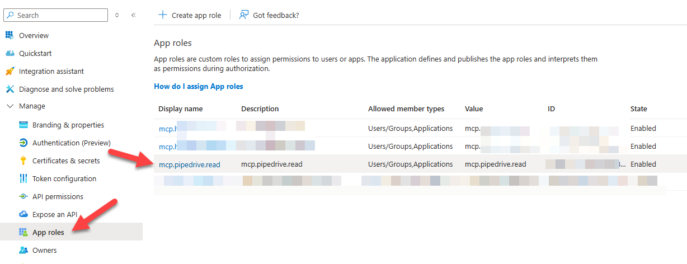
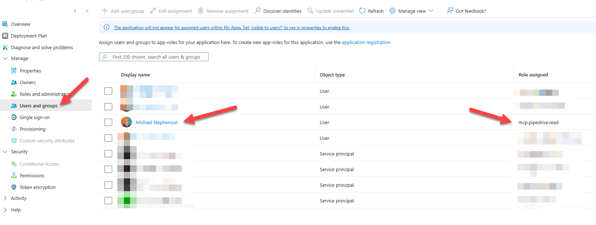
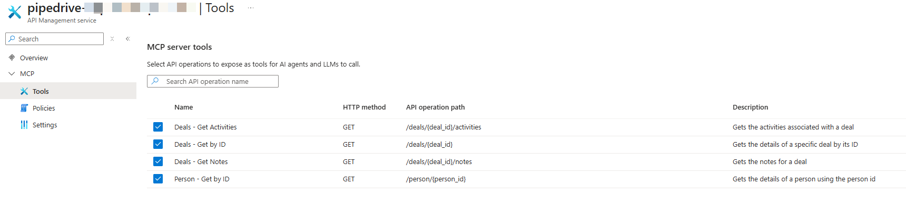
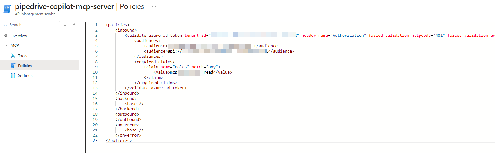
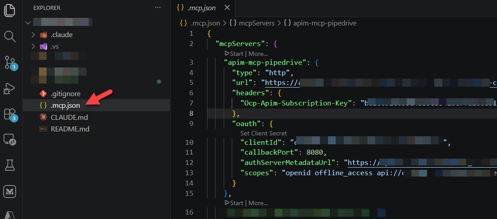
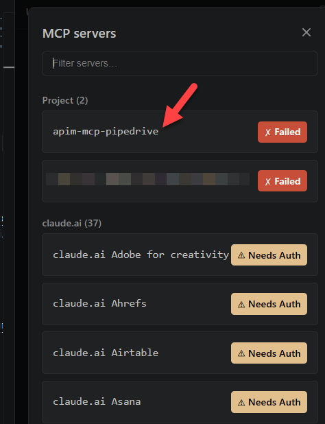

## Aim

- I am using claude in VS code.
- I want to connect some MCP servers to my claude code to query pipedrive and a custom application.
- I want to ensure those connectors are secured with Entra authentication

## Approach

- I want to use APIM as a proxy to my API's which are already out there
- I want to register the APIM as an MCP in VS Code so claude picks them up
- I want to authenticate to APIM with entra

## Architecture Overview

```
Claude Code (.mcp.json, OAuth client)
        │
        │ 1. GET /.well-known/oauth-protected-resource/pipedrive-copilot-mcp-server/mcp
        │ 2. GET  {authorization_servers}/.well-known/openid-configuration
        │ 3. GET  /oauth-proxy/authorize   (redirect, resource param stripped)
        │ 4. POST /oauth-proxy/token       (code exchange, resource param stripped)
        │ 5. POST /pipedrive-mcp-server/mcp   (Authorization: Bearer <token>)
        ▼
Azure API Management — api-kv-sales-marketing (rg-kovai-pipedrive-events)
  ├─ oauth-proxy                              (Entra OAuth proxy — see §4)
  ├─ well-known-oauth-protected-resource       (RFC 9728 metadata — see §3)
  ├─ pipedrive-mcp-server (type: mcp)  (validates token, exposes 4 tools)
  └─ pipedrive-api            (backend REST API, per-tool policies)
        │
        ▼
Azure Function App: pipedrive-api-helper  (calls the real Pipedrive API)
```

### Authentication Deeper Dive
```
Claude Code (.mcp.json, oauth section)
        │  OAuth 2.0 Authorization Code + PKCE, loopback redirect (localhost:8080)
        ▼
Entra ID (tenant [Name = MikesEntraTenant])
   App registration: [Name =  MikesAppReg-MCP-Servers] (public client)
        │  issues access_token + refresh_token (scopes: openid, offline_access, api://.../user_impersonation)
        ▼
APIM "oauth-proxy" API  (transparent proxy — /authorize, /token, /.well-known/*)
        │  rewrites requests to Entra's real endpoints, forwards responses untouched
        ▼
login.microsoftonline.com/{tenant}/oauth2/v2.0/{authorize|token}
```

Once Claude Code holds a bearer token, it calls the actual MCP tool endpoints directly:

- `https://mikes-apim.azure-api.net/pipedrive-mcp-server/mcp`
- `https://mikes-apim.azure-api.net/mikes-custom-app-mcp-server/mcp`

Both require the bearer token (Entra-issued) **and** an `Ocp-Apim-Subscription-Key` header (a normal APIM product subscription key, separate from the OAuth layer).

I added the subscription key which will be held in the project as a 2nd layer of security but this is optional.  Entra is the main focus.

## Entra Auth Workaround

In this section we will build a proxy to Entra which will be used for authentication so that there is no mismatch between authentication happening with entra but the MCP servers being hosted in APIM.

### 1. Auth Discovery Document

Build a new API in APIM which is used as the RFC 9728 discovery document rather than Entra directly.

The reason for this is:
- MCP clients query this unconditionally, and if it 404s, some clients don't fail cleanly
- They silently retry discovery forever and never attempt the real call
- **The `resource` field must exactly equal the real URL the client is calling** (its own origin + path) — clients validate this themselves and reject any deviation, including a well-intentioned attempt to point it at the Entra app identifier instead. 
- `authorization_servers` points at the proxy you're about to build, not at `login.microsoftonline.com` directly.

The wildcard path means this one API can serve every MCP server on the same APIM instance — build it once.

New APIM API: 
- Path `.well-known/oauth-protected-resource`
- One wildcard operation `GET /{*resourcePath}`, no real backend needed:

```xml
<inbound>
  <base />
  <return-response>
    <set-status code="200" reason="OK" />
    <set-header name="Content-Type" exists-action="override"><value>application/json</value></set-header>
    <set-body>@{
        string resourcePath = (string)context.Request.MatchedParameters["resourcePath"];
        string gatewayOrigin = "https://" + context.Request.OriginalUrl.Host;
        return new JObject(
            new JProperty("resource", gatewayOrigin + "/" + resourcePath),
            new JProperty("authorization_servers", new JArray(gatewayOrigin + "/oauth-proxy")),
            new JProperty("bearer_methods_supported", new JArray("header"))
        ).ToString();
    }</set-body>
  </return-response>
</inbound>
```

## 2. The Entra OAuth proxy

We now need an API which will proxy Entra for the token and authorization calls.  Entra will be the backend for this API but we are just proxying it so that the MCP calls and authentication calls look like they all come from the same domain.

New APIM API
- Path `oauth-proxy`
- Backend `serviceUrl = https://login.microsoftonline.com`
- three operations:

| Operation | Route | Job |
|---|---|---|
| Discovery | `GET /.well-known/openid-configuration` | Fetch Entra's real discovery doc, rewrite two endpoint URLs to point at this proxy |
| Authorize | `GET /authorize` | 302 to Entra's real `/authorize`, stripping `resource` |
| Token | `POST /token` | Forward to Entra's real `/token`, stripping `resource` from the form body |

**Discovery:**

```xml
<inbound>
  <base />
  <send-request mode="new" response-variable-name="aadDiscoveryResponse" timeout="20" ignore-error="false">
    <set-url>https://login.microsoftonline.com/{tenant-id}/v2.0/.well-known/openid-configuration</set-url>
    <set-method>GET</set-method>
  </send-request>
  <return-response>
    <set-status code="200" reason="OK" />
    <set-header name="Content-Type" exists-action="override"><value>application/json</value></set-header>
    <set-body>@{
        var resp = ((IResponse)context.Variables["aadDiscoveryResponse"]).Body.As<JObject>();
        string gatewayOrigin = "https://" + context.Request.OriginalUrl.Host;
        resp["authorization_endpoint"] = gatewayOrigin + "/oauth-proxy/authorize";
        resp["token_endpoint"] = gatewayOrigin + "/oauth-proxy/token";
        return resp.ToString();
    }</set-body>
  </return-response>
</inbound>
```
Leave `issuer`, `jwks_uri`, `scopes_supported`, etc. untouched — only the two endpoints the client will actually call through you get rewritten.

**Authorize** (pure redirect, no backend call):

```xml
<inbound>
  <base />
  <return-response>
    <set-status code="302" reason="Found" />
    <set-header name="Location" exists-action="override">
      <value>@{
          string queryString = string.Join("&", context.Request.OriginalUrl.Query
              .Where(kvp => kvp.Key != "resource")
              .SelectMany(kvp => kvp.Value.Select(v => {
                  string val = kvp.Key == "scope" ? v.Replace("+", " ") : v;
                  return Uri.EscapeDataString(kvp.Key) + "=" + Uri.EscapeDataString(val);
              })));
          return "https://login.microsoftonline.com/{tenant-id}/oauth2/v2.0/authorize?" + queryString;
      }</value>
    </set-header>
  </return-response>
</inbound>
```
The `scope` special-case (`+` → space) matters even for a single-scope request the moment a second scope gets added later — query strings don't treat `+` as space the way form bodies do, and without this, Entra AD rejects the combined value as one malformed scope name (`AADSTS65005`). Build it in now rather than rediscovering it later.

**Token** (an actual forwarded call, body rewritten):

```xml
<inbound>
  <base />
  <rewrite-uri template="/{tenant-id}/oauth2/v2.0/token" copy-unmatched-params="false" />
  <set-body>@{
      string original = context.Request.Body.As<string>(preserveContent: true);
      var pairs = original.Split('&')
          .Select(p => p.Split(new char[]{'='}, 2))
          .Where(kv => kv[0] != "resource")
          .Select(kv => kv.Length > 1 ? kv[0] + "=" + kv[1] : kv[0]);
      return string.Join("&", pairs);
  }</set-body>
  <set-header name="Content-Type" exists-action="override"><value>application/x-www-form-urlencoded</value></set-header>
</inbound>
<backend><base /></backend>
```

This same logic handles both the `authorization_code` grant and (if you requested `offline_access`) the `refresh_token` grant — both bodies just get `resource` stripped the same way. Leave `outbound` untouched so Entra's real response (success or error) reaches the client unmodified.


**Do not add request/response body logging here beyond what you need to verify it works once, and remove it immediately after** — these bodies contain authorization codes, refresh tokens, and access tokens. If you need to debug it, add a temporary `<trace>` on `context.Request.Body`/`context.Response.Body`, confirm the fix, then delete the trace in the same sitting.


## Build the Solution

Now you have configured the Entra authentication workaround, now lets build the API and MCP server.

### 1. Entra ID App Registration ✅

| Property | Value |
|---|---|
| Display name | `MikesAppReg-MCP-Servers` |
| App (client) ID | `00000000-0000-0000-0000-000000000000` |
| Tenant ID | `xxxxxxxx-xxxx-xxxx-xxxx-xxxxxxxxxxxx` |
| Sign-in audience | `AzureADMyOrg` (single tenant) |
| Public client fallback | `true` (`isFallbackPublicClient`) — required for PKCE with no client secret |
| Redirect URIs (platform: **Mobile and desktop applications**) | `http://localhost:8080/callback`, `http://localhost` |
| Redirect URI (platform: Web) | `https://global.consent.azure-apim.net/redirect/...` — this one is APIM's own "test in portal" OAuth2 user-authorization helper, unrelated to Claude Code |
| API permissions | Microsoft Graph `User.Read` (delegated) |

**Why "Mobile and desktop applications" matters:** this is what lets a CLI doing a loopback-redirect PKCE flow get a normal, long-lived refresh token. Registering the same redirect URI under "Single-page application" instead uses a stricter SPA refresh-token model (short-lived, rotated, tied to a browser origin) and would break a CLI client. If this ever needs to be recreated, register the redirect URI under the **Mobile and desktop applications** platform, not SPA or Web.

`offline_access` does not need to be listed under API permissions/`requiredResourceAccess` — it's an OIDC scope Entra grants automatically when requested in the auth request, which is what `.mcp.json` does (see §4).

#### Gotcha - Mark it as public client

This is not the default, and skipping it produces a token-exchange failure that looks unrelated to "public client" at first glance:
```
AADSTS7000218: The request body must contain the following parameter: 'client_assertion' or 'client_secret'.
```
Fix, via Graph (not reliably settable through `az ad app update`'s public-client flags):
```
PATCH https://graph.microsoft.com/v1.0/applications(appId='{your-app-id}')
{
  "isFallbackPublicClient": true,
  "publicClient": {
    "redirectUris": ["http://localhost", "http://localhost:8080/callback"]
  }
}
```


### 2. Entra ID App Registration Roles

Following the creation of the App Registration you also need to go to the Roles

Add one app role per permission group you want to gate access on, e.g.:



```json
{
  "allowedMemberTypes": ["User", "Application"],
  "displayName": "mcp.myapp.read",
  "value": "mcp.myapp.read",
  "id": "<a new GUID>"
}
```
Authorization downstream is checked against the `roles` claim on the token

### 3. Entra ID Enterprise App

Go to the enterprise app associated with your App Registration.

**Assign the role** to every user or service principal that needs access — being able to sign in is a separate thing from holding the role, and it's easy to build everything else correctly and forget this step, then spend time debugging a client-side "stuck" auth flow that's really just an unassigned role. Assign via Enterprise Application → Users and groups

Refer to this picture 




### 4. `.mcp.json` (Claude Code side) ✅

```jsonc
{
  "mcpServers": {
    "apim-mcp-pipedrive": {
      "type": "http",
      "url": "https://mikes-apim.azure-api.net/pipedrive-mcp-server/mcp",
      "headers": { "Ocp-Apim-Subscription-Key": "[Subscription-Key-Here]" },
      "oauth": {
        "clientId": "[App-Reg-Client-ID-Here]",
        "callbackPort": 8080,
        "authServerMetadataUrl": "https://mikes-apim.azure-api.net/oauth-proxy/.well-known/openid-configuration",
        "scopes": "openid offline_access api://[App-Reg-Client-ID-Here]/user_impersonation"
      }
    }

    // Other MCP's would go here

  }
}
```

The MCP servers share the same Entra app registration and the same `oauth-proxy`. Claude Code runs a loopback
listener on `callbackPort: 8080` during the interactive login (`/mcp` in an interactive session), matching the
`http://localhost:8080/callback` redirect URI registered in Entra.


## 5. The actual API endpoints (`.../api/pipedrive`, `.../api/mikes-custom-app`) ⚠️

These API's exist already as API's in my API Management.

For the purposes of this article I am not going to go into the specific of how they connect to their backend services.  I am simply going to show how these API's have an inbound policy at the "All Operations" level

```
<policies>    
    <inbound>
        <base />

        <!-- Remove subscription key so its not passed to backend -->
        <set-header name="ocp-apim-subscription-key" exists-action="delete" />

        <!-- Get Access Token to a variable so we can use it later -->
        <set-variable name="accessToken" value="@(context.Request.Headers.GetValueOrDefault("Authorization", "").Replace("Bearer ", "").Trim())" />

        <choose>
            <!-- If token is not supplied deny access -->
            <when condition="@(string.IsNullOrEmpty((string)context.Variables["accessToken"]) || ((string)context.Variables["accessToken"]).AsJwt() == null)">

                <return-response>
                    <set-status code="401" reason="Unauthorized" />
                    <set-header name="Content-Type" exists-action="override">
                        <value>application/json</value>
                    </set-header>
                    <set-body>@{
                        return new JObject(
                            new JProperty("error", new JObject(
                                new JProperty("statusCode", 401),
                                new JProperty("reason", "Unauthorized"),
                                new JProperty("message", "Access token is missing or not a valid JWT.")
                            ))
                        ).ToString();
                    }</set-body>
                </return-response>
            </when>
        </choose>

        <!-- Capture some variables from token claims so I can log info later -->
        <set-variable 
            name="userId" 
            value="@(((string)context.Variables["accessToken"]).AsJwt().Claims["oid"].FirstOrDefault())" />

        <set-variable 
            name="userName" 
            value="@(((string)context.Variables["accessToken"]).AsJwt().Claims["name"].FirstOrDefault())" />

        <set-variable 
            name="scp" 
            value="@(((string)context.Variables["accessToken"]).AsJwt().Claims["scp"].FirstOrDefault())" />

        <set-variable 
            name="aud" 
            value="@(((string)context.Variables["accessToken"]).AsJwt().Claims["aud"].FirstOrDefault())" />

        <!-- Validate Token and Claims -->
        <validate-azure-ad-token        
            tenant-id="[Tenant ID Goes Here]"   
            header-name="Authorization" 
            failed-validation-httpcode="401" 
            failed-validation-error-message="Unauthorized. Access token is missing or invalid.">
            <audiences>
                <audience>[APP REG Client ID Goes Here]</audience>
                <audience>api://[APP REG Client ID Goes Here]</audience>
            </audiences>
            <required-claims>
                <claim name="roles" match="any">

                    <!-- NOTE: We will talk about this later -->
                    <value>my.api.read</value>
                </claim>
            </required-claims>
        </validate-azure-ad-token>

        <!-- I want to log a custom message to App Insights so I can see who used my API -->
        <trace source="pipedrive-api-usage" severity="information">
            <message>@("API call: " + context.Api.Name + " / " + context.Operation.Name)</message>
            <metadata name="userId" value="@((string)context.Variables["userId"])" />
            <metadata name="userName" value="@((string)context.Variables["userName"])" />
            <metadata name="scope" value="@((string)context.Variables["scp"])" />
            <metadata name="audience" value="@((string)context.Variables["aud"])" />
            <metadata name="apiName" value="@(context.Api.Name)" />
            <metadata name="operationName" value="@(context.Operation.Name)" />
        </trace>
        
        <!-- Remove auth header so its not sent to the backend -->
        <set-header name="Authorization" exists-action="delete" />
        
    </inbound>    
    <backend>
        <base />
    </backend>    
    <outbound>
        <base />
    </outbound>
    <on-error>
        <base />
    </on-error>
</policies>

```

### 6. The MCP endpoints (`.../pipedrive-mcp-server/mcp`, `.../mikes-custom-app-mcp-server/mcp`) ⚠️

We then use the MCP Server feature in the APIM namespage and add an MCP for each API.

On the tools screen we choose the API operations from the API which we want to expose.

We then add a policy which we will use on the MCP layer.

In this case it may look like I have doubled up the token validation policy for Entra.  This is true.  I have the policy at the API layer anyway so if anyone is calling the API directly not via MCP then the authentication is honoured.

In terms of token validation at MCP layer I may choose to validate different claims if I want to add an additional claim to use the MCP or I may want to ensure MCP is always Entra secured but I might know that later I may change the API to use something else.

```
<policies>
	<inbound>
		<validate-azure-ad-token 
        tenant-id="[Tenant ID Goes Here]" 
        header-name="Authorization" 
        failed-validation-httpcode="401" 
        failed-validation-error-message="Unauthorized. Access token is missing or invalid.">
			<audiences>
				<audience>[APP REG Client ID Goes Here]</audience>
				<audience>api://[APP REG Client ID Goes Here]</audience>
			</audiences>
			<required-claims>
				<claim name="roles" match="any">
					<value>my.api.read</value>
				</claim>
			</required-claims>
		</validate-azure-ad-token>
	</inbound>
	<backend>
		<base />
	</backend>
	<outbound>
	</outbound>
	<on-error>
		<base />
	</on-error>
</policies>
```

Images:





## Using the APIM & MCP Servers

Now we have the APIM / MCP server solution setup we are ready to use it in our solution.

### 1. mcp.json

Now if we review mcp.json you will see the mcp servers registered and we are ready to go.



### 2 . Authenticate the MCP

In the claude code window we now type

```
/mcp
```

We will see registered mcp servers and we will be able to click on our mcp server



We can not click the authenticate button where thr browser will redirect us out to claude for authentication and then redirect us back to an active mcp server in vscode

### 3. Calling my MCP server

I can now use prompts in claude code which the LLM will map to tools within the mcp server so if I ask for information it would trigger the tool which will then call the MCP exposed by APIM.

This will then forward the request to the normal API.

This will then forward the request to by backend application.

At each stage the authentication uses my Entra token.

